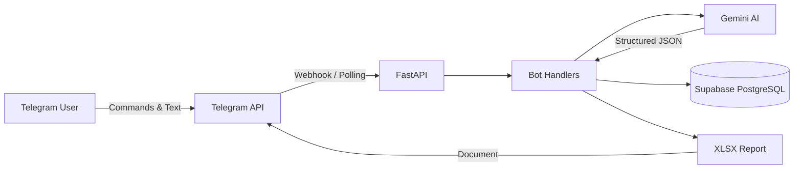

# 🕐 Time Cop

Telegram bot for time tracking powered by AI. Describe your workday in natural language and Time Cop structures, categorises, and stores your activities automatically.

## Architecture



## Stack

| Component | Technology |
|-----------|-----------|
| Backend | Python 3.11 + FastAPI |
| Bot | python-telegram-bot 21.x (async) |
| Database | Supabase (PostgreSQL) via asyncpg |
| AI | Google Gemini 2.0 Flash |
| Reports | openpyxl (XLSX) |
| Deployment | Docker → Azure App Service |

## Quick Start

### 1. Clone & install

```bash
cd time_cop
python -m venv .venv
.venv\Scripts\activate        # Windows
# source .venv/bin/activate   # Linux/Mac
pip install -r requirements.txt
```

### 2. Configure environment

```bash
cp .env.example .env
# Edit .env with your credentials
```

### 3. Run locally (polling mode)

Leave `WEBHOOK_URL` empty in `.env` to use polling mode (no public URL needed):

```bash
uvicorn app.main:app --reload
```

The bot will automatically connect to Telegram in polling mode.

### 4. Run with Docker

```bash
docker build -t time_cop .
docker run --env-file .env -p 8000:8000 time_cop
```

## Environment Variables

| Variable | Required | Default | Description |
|----------|----------|---------|-------------|
| `TELEGRAM_BOT_TOKEN` | ✅ | — | Bot token from @BotFather |
| `DATABASE_URL` | ✅ | — | PostgreSQL connection string |
| `GEMINI_API_KEY` | ✅ | — | Google Gemini API key |
| `TIMEZONE` | ❌ | `America/Bogota` | Timezone for date calculations |
| `LOG_LEVEL` | ❌ | `INFO` | Logging level |
| `WEBHOOK_URL` | ❌ | — | Public URL (empty = polling mode) |
| `DB_POOL_MIN_SIZE` | ❌ | `2` | Min DB connections |
| `DB_POOL_MAX_SIZE` | ❌ | `10` | Max DB connections |

## Bot Commands

| Command | Description |
|---------|-------------|
| `/start` | Welcome & help |
| `/registrar_dia_actual` | Record today's activities |
| `/registrar_otro_dia` | Record a past day |
| `/recuperar_registro_por_fecha` | View records for a date |
| `/ver_semana` | Weekly summary |
| `/generar_reporte` | Generate monthly XLSX report |
| `/eliminar_registro` | Delete a record |

## Database Schema

The app expects these tables in your Supabase instance:

```sql
CREATE TABLE registros_tiempo (
    id UUID PRIMARY KEY DEFAULT gen_random_uuid(),
    fecha DATE NOT NULL,
    usuario_telegram_id BIGINT NOT NULL,
    descripcion TEXT NOT NULL,
    proyecto TEXT NOT NULL,
    categoria VARCHAR(50) CHECK (categoria IN (
        'proyectoFacturable', 'proyectoNoFacturable', 'otrosNoFacturable'
    )),
    horas_estimadas DECIMAL(4,2),
    texto_original TEXT,
    created_at TIMESTAMP DEFAULT NOW(),
    updated_at TIMESTAMP DEFAULT NOW()
);

CREATE TABLE estados_usuarios (
    telegram_id BIGINT PRIMARY KEY,
    estado VARCHAR(50),
    datos_temporales JSONB,
    updated_at TIMESTAMP DEFAULT NOW()
);
```

## Testing

```bash
python -m pytest tests/ -v
```

## Deployment (Azure App Service)

1. Build & push Docker image to Azure Container Registry
2. Create Azure App Service (Linux, Python 3.11)
3. Configure env vars in Application Settings
4. Set `WEBHOOK_URL=https://your-app.azurewebsites.net`
5. The app will automatically configure the Telegram webhook on startup
